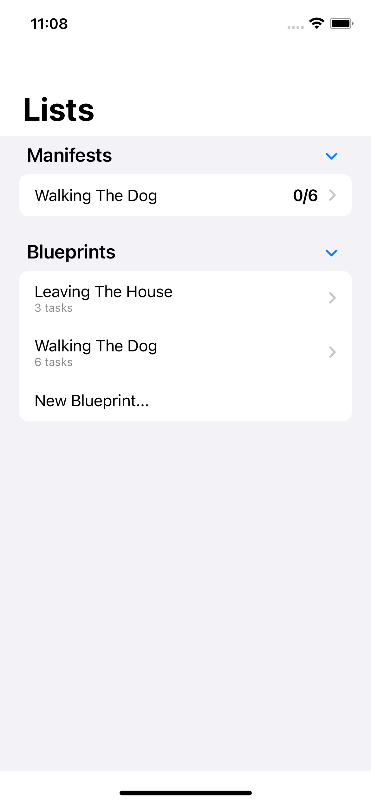
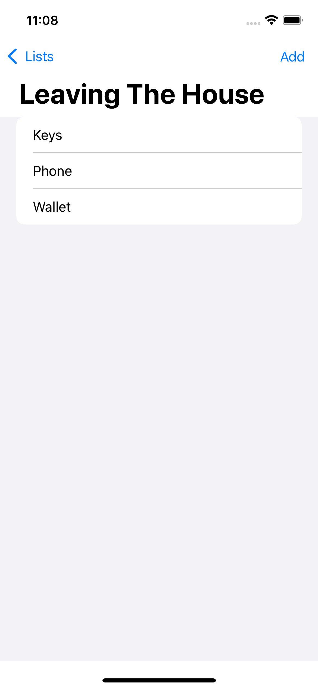

#  Listomania

1. You can make lists of completable items
2. You actually don't make lists. You make 'blueprints' which are then used to create a manifest (which is your actual, precious list)
3. Lists can contain other lists

